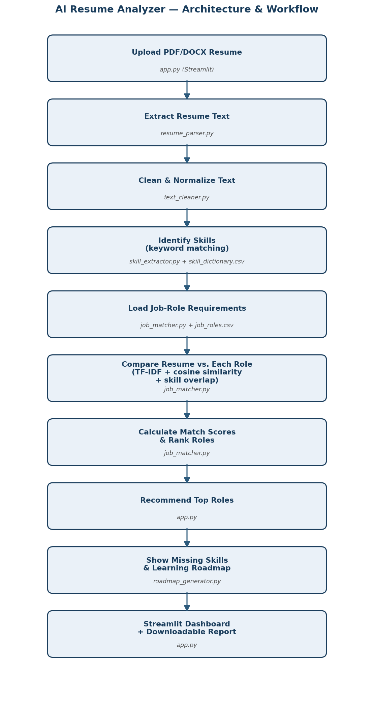

# AI Resume Analyzer and Job Recommendation System

An NLP-based Streamlit application that analyzes how well a resume matches
different job roles, identifies missing skills, and generates a simple
learning roadmap to close the gap.



## Project Overview

- **Problem it solves:** students often don't know whether their resume
  contains the skills expected for a role. This tool gives an automated,
  transparent first estimate.
- **Approach used:** the "beginner approach" from the project brief --
  keyword-based skill extraction, TF-IDF + cosine similarity for text
  matching (blended with a direct skill-overlap ratio), and a rule-based
  learning roadmap. No labelled ML model or LLM API key is required to
  run the core features.

## Folder Structure

```
ai_resume_analyzer/
|-- app.py                    # Streamlit dashboard (entry point)
|-- resume_parser.py           # PDF/DOCX text extraction
|-- text_cleaner.py             # Text cleaning & normalization
|-- skill_extractor.py           # Keyword-based skill extraction
|-- job_matcher.py                # TF-IDF + cosine similarity + skill-overlap scoring
|-- roadmap_generator.py           # Rule-based learning roadmap
|-- requirements.txt
|-- README.md
|-- .env.example                    # Only needed for the optional LLM-feedback feature
|-- .gitignore
|-- architecture_diagram.png
|-- build_sample_resumes.py          # Regenerates the sample resumes below
|-- run_pipeline_test.py              # End-to-end pipeline sanity test
|
|-- data/
|   |-- job_roles.csv                  # 8 job roles + required skills
|   |-- skill_dictionary.csv            # 50 skills across 6 categories
|
|-- sample_resumes/                      # 3 sanitized sample resumes (PDF + DOCX)
|-- reports/                              # Downloaded reports land here locally (gitignored)
|-- tests/
    |-- test_cases.csv                      # Testing sheet (expected vs actual top role)
    |-- evaluation_notes.md                  # Extraction/precision/recall/fairness notes
```

## Setup

1. **Create and activate a virtual environment** (recommended):
   ```
   python -m venv venv
   # Windows:
   venv\Scripts\activate
   # Mac/Linux:
   source venv/bin/activate
   ```

2. **Install dependencies:**
   ```
   pip install -r requirements.txt
   ```

3. **Run the app:**
   ```
   streamlit run app.py
   ```
   This opens the dashboard at `http://localhost:8501`.

4. **Try it out:** upload one of the files in `sample_resumes/` (or your
   own PDF/DOCX resume), pick a target role, and explore the results.

## How It Works

See `architecture_diagram.png` for the full pipeline. In short:

1. **Upload** (`app.py`) -- accepts a PDF or DOCX file, validates type/size.
2. **Extract** (`resume_parser.py`) -- pulls raw text from every page/paragraph.
3. **Clean** (`text_cleaner.py`) -- lowercases and strips noisy symbols while
   preserving technical terms like `C++`, `C#`, `.NET`.
4. **Extract skills** (`skill_extractor.py`) -- matches cleaned text against
   a 50-skill controlled dictionary (`data/skill_dictionary.csv`), including
   common aliases (e.g. "ml" -> "machine learning").
5. **Match & rank roles** (`job_matcher.py`) -- for each of the 8 job roles
   in `data/job_roles.csv`, computes a blended score: 60% skill-overlap
   ratio + 40% TF-IDF/cosine text similarity.
6. **Roadmap** (`roadmap_generator.py`) -- turns the missing skills for a
   selected target role into a week-by-week learning roadmap.
7. **Dashboard** (`app.py`) -- shows all of the above, plus a downloadable
   `.txt` analysis report.

## Testing

Run the automated end-to-end sanity check (extracts, matches, and verifies
the top-recommended role for all 3 sample resumes in both PDF and DOCX form):

```
python run_pipeline_test.py
```

See `tests/test_cases.csv` for the results table and `tests/evaluation_notes.md`
for qualitative notes on extraction quality, skill precision/recall, role
ranking, score consistency, fairness, and usability.

## Responsible AI

This tool follows the responsible-AI rules from the project brief:

- **Guidance only** -- not used for automatic hiring or rejection decisions.
- **No protected attributes** -- never scores gender, age, religion,
  nationality, photograph, marital status, or disability. Only job-related
  skills, education, projects, and experience text is evaluated.
- **Estimates, not decisions** -- every score is shown with a plain-language
  disclaimer in both the dashboard and the downloadable report.
- **No permanent storage** -- uploaded resumes are processed entirely in
  memory for the current session; nothing is written to disk.
- **Keyword limits are disclosed** -- the roadmap and report explicitly
  note that a missing keyword does not always mean missing ability.

## Limitations

- **Keyword-matching skill extraction** only detects skills present in
  `data/skill_dictionary.csv` (50 skills). A resume mentioning a skill
  under an unlisted name/spelling won't be detected -- this is the
  documented tradeoff of the beginner approach vs. NLP/LLM-based extraction.
- **Scanned/image-only PDFs** cannot be read (no OCR is implemented);
  `resume_parser.py` raises a clear error in this case rather than
  silently returning empty text.
- **TF-IDF/cosine similarity is a bag-of-words method** and doesn't
  understand semantic meaning the way Sentence Transformers would (a
  documented "advanced approach" upgrade path in the project brief).
- **The 8-role, 50-skill reference data is illustrative**, not exhaustive
  -- a production version would need a broader, continuously maintained
  dataset.

## Optional Advanced Features (Not Implemented)

Per the project brief, these are optional upgrades beyond the required
minimum feature set, intentionally left out of this submission to keep
the beginner-approach pipeline fully self-contained and free of external
API dependencies:

- LLM-generated resume feedback (would need a Groq/Gemini/OpenAI API key
  -- see `.env.example` for the expected format if you add this).
- Sentence Transformers for semantic matching.
- FastAPI backend, database, and Docker deployment.
- Resume section detection (education/skills/projects/experience) beyond
  the current whole-text approach.

## Deployment

To deploy to Streamlit Community Cloud:

1. Push this folder to a GitHub repository (see below).
2. Go to [share.streamlit.io](https://share.streamlit.io), sign in with
   GitHub, and select this repository + `app.py` as the entry point.
3. Streamlit Cloud will install `requirements.txt` and deploy automatically.

## Pushing to GitHub

```
cd ai_resume_analyzer
git init
git add .
git commit -m "Initial commit: AI Resume Analyzer and Job Recommendation System"
git branch -M main
git remote add origin https://github.com/<your-username>/<your-repo-name>.git
git push -u origin main
```
